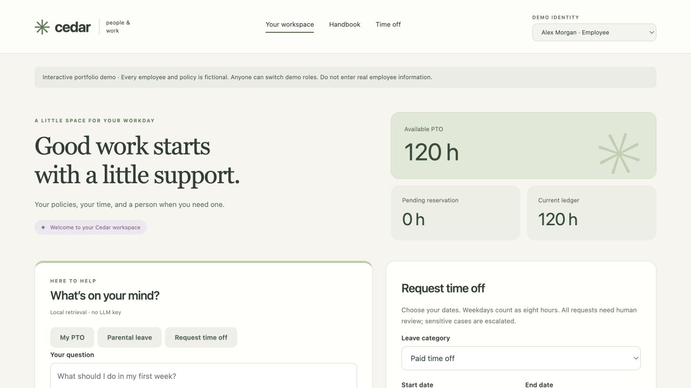
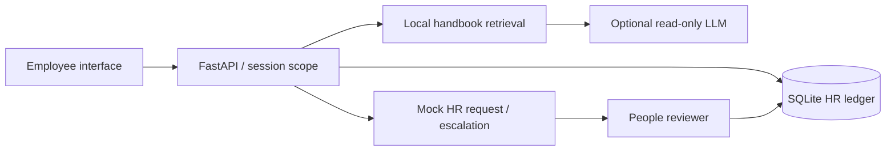

# Employee Operations Assistant

A small employee self-service tool for a fictional company. Ask a handbook question, check your own PTO balance, submit time off, and switch to a People reviewer to finish the workflow.

I built this around a common bottleneck: routine employee questions and requests that interrupt a People team. The interesting part is the boundary between answering a question and taking an action. The assistant can explain a policy; application code controls access, reservations and approvals.

**Demo:** fictional employees and handbook, local role switching, and mock HR requests. Runs without an API key; optional AI generation adds answers grounded in retrieved passages.



## Try it locally

Requires Python 3.12 or later. No paid API or account is needed for the default demo.

```sh
python3 -m venv .venv
source .venv/bin/activate
python -m pip install -r requirements.txt
python -m uvicorn app:app --host 127.0.0.1 --port 8101
```

On Windows, activate with `.venv\Scripts\activate` instead. Open <http://127.0.0.1:8101>. Interactive API documentation is at `/docs`.

1. As Alex, ask “How much PTO do I have?” The answer comes from the ledger.
2. Ask “What is the parental leave policy?” Open the cited handbook section.
3. Submit a future weekday PTO request. Watch the available hours decrease while the request is pending.
4. Switch to Sam, add a review note, and approve. Switch back to Alex to see the updated ledger.
5. Try medical leave, a request longer than five weekdays, an overlapping request, or “Am I eligible for parental leave?” to see the controls.

## What runs

- FastAPI API and a responsive browser interface, with persistent SQLite storage.
- A small in-memory TF-IDF vector index over five versioned handbook sections. This is lexical retrieval, not a semantic embedding model. Source excerpts remain visible.
- Optional OpenAI generation over retrieved policy passages. Personal balances and workflow actions never enter that model call.
- Server-scoped employee records, a reviewer-only queue, audit events and a finite request lifecycle.
- Weekday calculations, pending-hour reservations, overlap checks, idempotent creation and transactional approval. Concurrent approval cannot deduct PTO twice.
- Human handling for sensitive categories, unsupported questions, insufficient balances and long requests. Sensitive, ambiguous and unsupported questions automatically open a generic People ticket, without storing the question text or complaint details. Repeated questions reuse the open ticket.



## Optional live AI

Set `OPENAI_API_KEY` in your terminal environment before starting the server. `OPENAI_MODEL` defaults to `gpt-4.1-mini` and can be changed to a Responses API model supporting Structured Outputs. Do not commit credentials. The model sees the question and selected fictional handbook passages; avoid entering personal information. Requests use `store: false`, which is not a claim of zero provider retention.

Without a key, answers show retrieved excerpts and the UI says **Local retrieval**. API errors, refusals, incomplete responses and invalid citations fall back to excerpts. The integration uses the [Responses API Structured Outputs format](https://developers.openai.com/api/docs/guides/structured-outputs). Model output is never used to execute or approve an action.

## Retrieval evaluation

```sh
python -m evals.retrieval_eval
```

The checked-in [40-question benchmark](evals/policy_questions.json) includes 20 supported policy questions, 8 unsupported questions, 9 sensitive/ambiguous/private questions, and 3 ledger/workflow questions. Current measured results: top-1 **20/20**, top-2 **20/20**, unsupported detection **8/8**, sensitive routing **9/9**. [Full results and per-case output](evals/results.json).

These are curated regression results, **not independent generalization accuracy**. Routing rules were improved using this suite. Personal “can I take” wording intentionally escalates rather than deciding eligibility; those cases are scored as routing, not retrieval. The suite tests retrieval and routing, not generated-answer faithfulness. New paraphrases and novel unsupported subjects can still fail.

Embedding comparison was deliberately deferred: the five-section corpus currently needs no model download, vector database, new provider or large ML dependency. No claim that lexical retrieval equals or beats embeddings is made. A future experiment should freeze an independently authored question set, compare recall and abstention at separately tuned thresholds, and report latency/cost alongside accuracy.

## Validation

```sh
python -m pip install -r requirements-dev.txt
python -m ruff check .
python -m ruff format --check .
node --check static/app.js
python -m pytest -q
```

Tests cover record isolation, attempted identity spoofing, sensitive-question routing, insufficient balances, invalid dates, overlapping requests, idempotency, concurrent approval, declined-request release, reviewer self-approval and the model contract/fallback. API service responses are mocked in tests; a real provider call requires your own key and has not been claimed as verified.

## Boundaries and tradeoffs

This is a **local synthetic portfolio demo**, not a production HR system. The role switcher intentionally lets anyone choose an identity; it is not real authentication. Bind to localhost. Production would require SSO, scoped reviewer permissions, durable sessions, abuse controls, privacy retention rules, a holiday calendar, a real HR adapter and policy review. Keyword routing is a conservative demonstration, not a complete sensitive-content detector. RAG can return an irrelevant passage and a generated answer can still be wrong; source visibility and human review remain necessary.

All non-PTO approvals mean **human follow-up acknowledged**, never a determination of leave eligibility. Insufficient-balance requests reserve zero hours and cannot be approved as PTO. Decline and discuss alternatives instead. Regular requests enter a local mock HR queue; no external HRIS, Slack message or email is sent.

No measured workplace savings are claimed. A pilot should measure repeated questions resolved, successful task completion, time to human review and incorrect-answer rate before claiming ROI.

Runtime data is stored in ignored `runtime/`. Set `APP_DB` to a new local path to start a separate demo. Sessions expire after one hour and reset when the server restarts. Only synthetic fixtures belong in this repository.

## Project updates

See [the changelog](docs/CHANGELOG.md) for interface and engineering updates.
